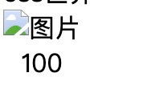
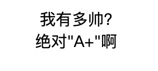
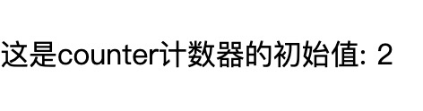
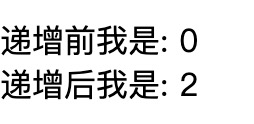
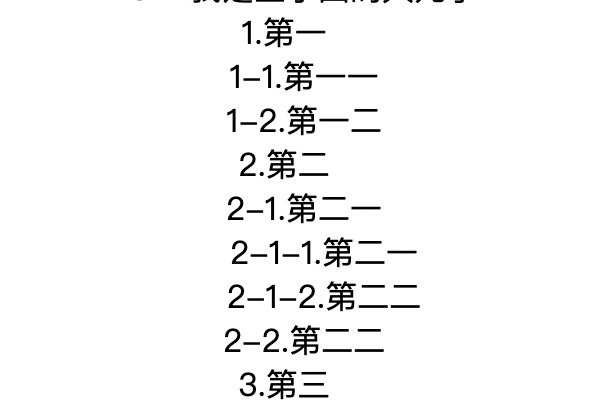

今天说一个非常有趣的`css`属性`content`，可能很多人都会说，这个属性谁会不知道，对于一些老手来说，这个属性确实可能是经常会用到，但是总会有你没有发现的地方，今天就来好好的讲讲这个有趣的`css`属性。
以下知识内容均来自于[张鑫旭的《css世界》](https://www.zhangxinxu.com/)，有兴趣的可以去看看。

## content 介绍
`content`用于元素内容的展示，平常用的多的地方在于内容前后的具体文字内容或者是图片。图片其实没有很多好介绍，但是关于文字方面，它有很多种的类型，下面就一一将`content`的值类型进行介绍。

### content 属性

1. **normal**  

这是`content`属性的默认值，在伪元素中会被认定为`none`

2. **none** 

指定不产生伪元素

3. **url**  

可以使用图片来进行展示，比如
```html
<style>
  div{
    text-align: center;
  }
  div::after{
    content: url('../images/有趣的css属性content/css世界.jpg');
    display: block;
  }
</style>
<div></div>
```
效果如下图


`url`的参数有很多种，最常用的就是路径  
然后就是`icon`、`svg`、`base64`编码的图片，但是不支持`css3渐变`背景图。  

虽然有这种方法可以生成图片，但是实际中并无太大用处，原因就在于无法通过设置宽高来改变图片的固有尺寸。  

一般都是使用`background-image`来实现相关的功能。

不过`base64`形式却能解决上面的问题
一般情况下图片在加载过程中都会存在尺寸为`0`的时候，所以在加载完成时页面会存在图片晃动的情况。  
`base64`图片没有这个过程。  
但是`base64`也有不好的地方，比如，`base64`编码后的图片体积比之前要大上1/3左右。

4. **attr**  

`attr`和它名字一样，它能够选择到该元素身上的属性。  
比如
```html
<style>
img{
  text-align:center;
}
img::after{
  content: attr(width);  
}
</style>

```


这样可以显示到`img`元素的`width`属性的值。    
并且，它还能够获取到自定义属性的值，比如`attr(data-name)`

注意一下，这里的属性名称是不需要**引号**的。

5. **string**  

这个的话我想应该不用多说，大家用的也是相当熟练的。但是不知道大家有没有使用过`Unicode`字符？  
在书中发现了一个利用此特性的小栗子🌰，感觉非常好用，这里写出来给大家参考一下。  
下面实现了一个动态loading加载的效果。
```html
<style>
  dot{
    display:inline-block;
    height:1em;
    line-height:1;
    overflow:hidden;
    text-align:left;
    vertical-align: -.25em;
  }
  dot::before{
    content: '...\A..\A.';
    animation: loading 3s infinite step-start both;
    display:block;
    white-space: pre-wrap;
  }
  @keyframes loading {
    33% { transform: translateY(-2em); }
    66% { transform: translateY(-1em); }
  }
</style>
<div>
加载中
  <dot>...</dot>
</div>
```

下面是效果，可能图片看起来有些不流畅，但是实际效果是流畅的。   


这一方法的好处就是相当好的兼容性，它利用上述特性和`css3`的动画效果来实现。 

并且在低版本浏览器下虽然支持不了`animation`属性，但是它也能良好的展示静态效果。

6. **open-quote、close-quote**  

关于这个属性，算是一个好用却又不实用的属性吧，它本身良好的特性可以完成平常的许多业务问题，但是却又显得没有那么必要。
```html
  <style>
    div p:nth-of-type(1){
      quotes: '提问: "' '"';
    }
    div p:nth-of-type(1){
      quotes: '回答: "' '"';
    }
    div p::before{
      content: open-quote;
    }
    div p::after{
      content: close-quote;
    }
  </style>
  <div>
    <p class="ques">为什么我这么帅？</p>
    <p class="answ">天生的！</p>
  </div>
```


还有`no-open-quote` `no-close-quote`，和名字一下，就是在开始和结束不需要该内容。

7. **counter**  

接下来最后要着重介绍的一个属性，`counter`。计数器。  

大家应该有见过`word`文档中的那种标题吧，其实那种样式可以通过`css`来自动生成。  
没有错，用到的就是现在介绍的这个属性。
它只需要几行css代码就能实现那样的效果。  

首先是相关的几个属性。
`counter-reset` `counter-increment` `counter()` `counters()`  

使用步骤如下：
- **定义计数器名称 counter-reset**  

```html
<style>
  div{
    counter-reset: counter-name 2;  
  }
  div::after{
    content: counter(counter-name);
  }
</style>
<div>这是counter计数器的初始值: </div>
```
上面定义了一个计数器，名称叫`counter-name` 并且起始为2


关于后面`起始数字`的问题，也可以是`负数`，也可以写成`小数`。  
不过对于`ie`和`firefox`是直接无视的，默认为`0`，而对于`chrome`来说则是处理成向下取整。  

你也可以同时定义多个计数器。如下
`counter-reset: coutner-name1 3 counter-name2 4`  

- **递增**  

第一步中实现的是显示计数器的值，而此步骤则是真正能让计数器开始计数的关键。  

`counter-increment` 用来让计数器累加，如下
```html
<style>
  div{
    counter-reset: counter;
  }
  div::before{
    content: '递增前我是: ' counter(counter);
    display:block;
  }
  div::after{
    counter-increment: counter 2;
    content: '递增后我是: ' counter(counter);
  }
</style>
<div></div>
```
如下图所示  

  

上面指定了`counter`计数器增加了`2`，后面的数字也可以是`负值`，这样就实现了递减的效果。  

需要注意的是，虽然在不同元素上计数器并不会产生效果，但是如果在其中使用了`counter-increment`那么它就会产生效果。  

`counter()`和`counters()`还有一些参数可以选择  
> counter(name, style)  
counters(name, string)  
counters(name, string, style)  

`strig`就是连接符  

`style`的话，它的值和`list-style`的值相同  
所以在展示时，可以不一定显示数字，也可以显示其他的字符。
具体可以参考 [list-style](https://www.w3school.com.cn/css/pr_list-style-type.asp)  

比如下面  

``` html
<style>
  .box{
    counter-reset: counter;
  }
  .box::before{
    content: '我有多帅?';
  }
  .counter::after{
    counter-increment: counter;
    quotes: '绝对"' '+"啊';
    content: open-quote counters(counter, '-', upper-latin) close-quote;
  }
</style>
<div className="box">
  <div className="counter"></div>
</div>  
```

效果如下图
  

关于前面说的`word`文档标题的级联效果，用到的就是`counters()`这个方法  

下面是简单的效果。  

```html
<style>
  .reset{
    counter-reset: counter;
  }
  .counter::after{
    counter-increament: counter;
    content: couters(counter, '-') '.';
  }
</style>
<div class="reset">
  <div class="counter">
    第一
    <div class="reset">
      <div class="counter">第一一</div>
      <div class="counter">第一二</div>
    </div>
  </div>
  <div class="counter">
    第二
    <div class="reset">
      <div class="counter">
        第二一
        <div class="reset">
          <div class="counter">第二一</div>
          <div class="counter">第二二</div>
        </div>
      </div>
      <div class="counter">第二二</div>
    </div>
  </div>  
  <div class="counter">
    第三
  </div>
</div>
```  

效果如下图  

  

## 完结
合理的使用css属性可以让你在实际开发过程中减少很多的工作，使用css完成的效果总比用css完成性能要好的多。

